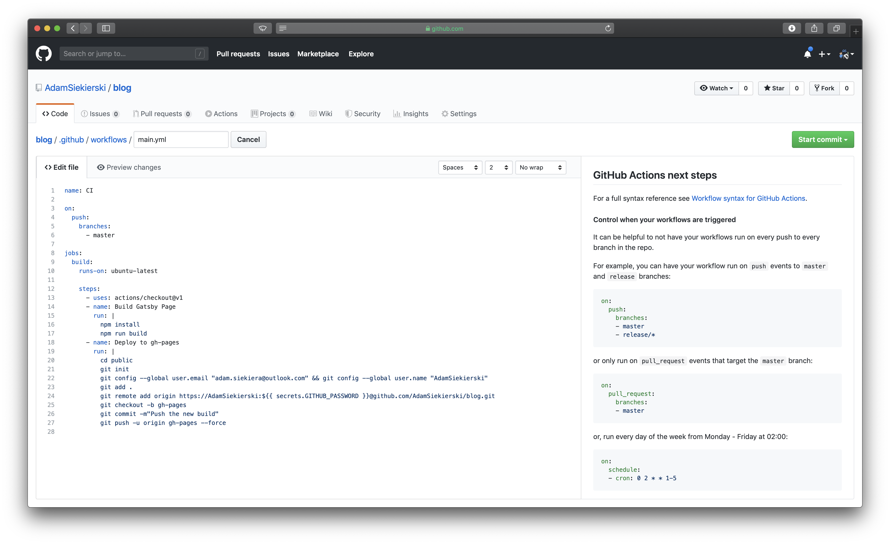

**3 days ago, I got an email**:

> Congrats—you’re in! Your account @AdamSiekierski now has beta access to GitHub Actions...

I was waiting for it since 2 weeks, and finally recived the access. As soon as I got back home, I have launched my computer and made a test. Based on what I read earlier, I was expecting something other than [CircleCI](https://circleci.com) or [Buddy](https://buddy.works).

### Well, I got dissapointed

So what actually is GithHub Actions? A CircleCI from GitHub. It's almost the same. On the [advertisment page](https://github.com/features/actions), you can see some fancy blocks, etc. In the reality it looks a lot more boring ;).

I also was thinking, that you would get a UI to interact with the steps of workflow... nope. You get a yaml text editor.


### As you can see, It's very similar to CircleCI.. Let's compare it

So the basic configuration, which builds my blog and pushes it to GitHub Pages looks like this:

```yaml
name: CI

on:
  push:
    branches:
      - master

jobs:
  build:
    runs-on: ubuntu-latest

    steps:
      - uses: actions/checkout@v1
      - name: Build Gatsby Page
        run: |
          npm install
          npm run build
      - name: Deploy to gh-pages
        run: |
          cd public
          git init
          git config --global user.email "adam.siekiera@outlook.com" && git config --global user.name "AdamSiekierski"
          git add .
          git remote add origin https://AdamSiekierski:${{ secrets.GITHUB_PASSWORD }}@github.com/AdamSiekierski/blog.git
          git checkout -b gh-pages
          git commit -m"Push the new build"
          git push -u origin gh-pages --force
```

Yes... It looks almost exactly the same as CircleCI. But it's quite diffrent. Starting from the top:

- You can set when exactly the workflow should start executing - here on push to master, but it can be also a pull request, etc.
- Next you choose the Docker image to run on. I have chosen the default - ubuntu-latest
- Next you have the steps:
  - First it gets the action named checkout, which checkouts the actual state of your repo.
  - Second builds the project
  - And third deploys it to GitHub Pages

#### What should you focus on?

1. The way how you declare third-party actions - you don't need to declare it on the beggining like orbs in CircleCI - you just pass the link or its name on GitHub, rest is done automatically
2. The "secret" on line 24 - you set the secret in your repo settings on GitHub, the string gets encrypted, and hidden from other users - very useful

#### The summary

The GitHub Actions platform has a big potential, but at the moment, it's a lot easier to use CircleCI, or (what I'm fan of) Buddy. If the community gets stronger, you will get more third-party actions (for example for sending emails with notifications). And I would want some better interaction than just the YAML - for the begginers it should be easier. The GitHub Actions need to wait for a while for now.
